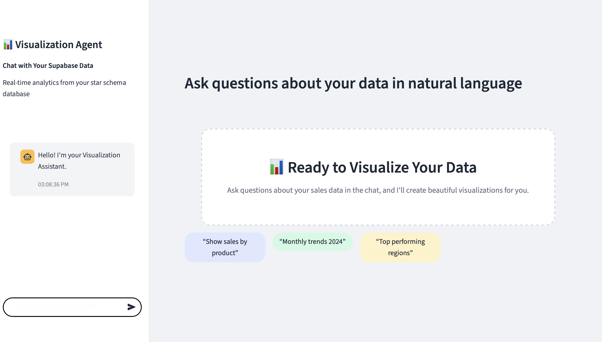

# 📊 Advanced Data Visualization Agent

An intelligent data visualization assistant built with Streamlit that allows users to interact with their Supabase database using natural language queries. The application leverages AI agents to understand user requests, execute SQL queries, and generate beautiful visualizations automatically.



## 🚀 Features

- **Natural Language Queries**: Ask questions about your data in plain English
- **Real-time Visualization**: Automatic chart generation based on your queries
- **Interactive Chat Interface**: Conversational AI assistant for data exploration
- **Supabase Integration**: Direct connection to your star schema database
- **Responsive Design**: Modern, clean interface optimized for data analysis
- **Modular Architecture**: Well-organized codebase for easy maintenance and extension

## 🏗️ Project Structure

```
AdvancedDatavisualisationAgent/
├── 📁 backend/                    # Backend logic and services
│   └── __init__.py
├── 📁 docs/                       # Documentation and assets
│   └── Frontend.png               # UI preview image
├── 📁 frontend/                   # Frontend components and styling
│   ├── __init__.py
│   ├── utils.py                   # CSS loading utilities
│   └── 📁 style/                  # Modular CSS files
│       ├── README.md              # CSS documentation
│       ├── base.css               # Base layout and typography
│       ├── sidebar.css            # Sidebar-specific styles
│       ├── chat.css               # Chat interface styles
│       ├── components.css         # UI components (buttons, etc.)
│       └── main.css               # Main CSS file
├── 📁 tests/                      # Test files
│   └── __init__.py
├── 📁 visual_agent/               # Core visualization agent logic
│   └── __init__.py
├── app.py                         # Main Streamlit application
├── pyproject.toml                 # Poetry configuration
├── poetry.lock                    # Locked dependencies
└── README.md                      # This file
```

## 🛠️ Technologies Used

- **[Streamlit](https://streamlit.io/)** - Web application framework
- **[Plotly](https://plotly.com/python/)** - Interactive visualization library
- **[Pandas](https://pandas.pydata.org/)** - Data manipulation and analysis
- **[Supabase](https://supabase.com/)** - Database backend (planned integration)
- **[Poetry](https://python-poetry.org/)** - Dependency management
- **CSS3** - Custom styling for modern UI

## 📋 Prerequisites

- Python 3.12+
- Poetry (for dependency management)
- Git

## 🚀 Quick Start

### 1. Clone the Repository

```bash
git clone https://github.com/your-username/AdvancedDatavisualisationAgent.git
cd AdvancedDatavisualisationAgent
```

### 2. Install Dependencies

```bash
# Install Poetry if you haven't already
curl -sSL https://install.python-poetry.org | python3 -

# Install project dependencies
poetry install
```

### 3. Activate Virtual Environment

```bash
poetry shell
```

### 4. Run the Application

```bash
streamlit run app.py
```

The application will open in your browser at `http://localhost:8501`

## 💡 Usage

### Getting Started

1. **Launch the App**: The interface consists of a sidebar chat panel and a main visualization area
2. **Ask Questions**: Use the chat input or click one of the suggested prompts:
   - "Show sales by product"
   - "Monthly trends 2024"
   - "Top performing regions"
3. **View Results**: The AI agent will process your query and display interactive visualizations

### Sample Queries

Try asking questions like:
- "What are the top-selling products this quarter?"
- "Show me sales trends by region"
- "Compare performance across different time periods"
- "Which products have declining sales?"

## 🎨 UI Components

### Sidebar Chat Interface
- **Chat History**: Displays conversation with timestamps
- **Input Box**: Natural language query input with black border styling
- **Real-time Updates**: Immediate response to user queries

### Main Visualization Area
- **Welcome Screen**: Guided introduction with sample prompts
- **Dynamic Charts**: Interactive Plotly visualizations
- **Research Insights**: Contextual information from RAG pipeline

### Styling Features
- **Modular CSS**: Organized styling in separate files
- **Responsive Design**: Adapts to different screen sizes
- **Modern Aesthetics**: Clean, professional appearance
- **Color-coded Elements**: Intuitive visual hierarchy

## 🔧 Configuration

### Environment Setup

Create a `.env` file in the project root for configuration:

```env
# Supabase Configuration (when integrated)
SUPABASE_URL=your_supabase_url
SUPABASE_KEY=your_supabase_key

# Other API keys
OPENAI_API_KEY=your_openai_key
```

### CSS Customization

The UI styling is organized in modular CSS files:

- `base.css` - Core layout and typography
- `sidebar.css` - Chat interface styling
- `chat.css` - Message and input styling
- `components.css` - Buttons and UI elements

## 🧪 Development

### Project Architecture

The application follows a modular architecture:

1. **Frontend Layer** (`frontend/`): UI components and styling
2. **Backend Layer** (`backend/`): Data processing and API integration
3. **Visualization Layer** (`visual_agent/`): Chart generation logic
4. **Main App** (`app.py`): Streamlit application entry point

### Adding New Features

1. **New CSS Styles**: Add to appropriate CSS file in `frontend/style/`
2. **Backend Logic**: Implement in `backend/` modules
3. **UI Components**: Create reusable functions in `frontend/utils.py`
4. **Tests**: Add test cases in `tests/` directory

### CSS Development

The project uses a modular CSS approach. To add new styles:

1. Choose the appropriate CSS file or create a new one
2. Add the file to the CSS loading list in `app.py`
3. Document changes in `frontend/style/README.md`

## 📝 Roadmap

### Phase 1: Core Features ✅
- [x] Basic Streamlit interface
- [x] Chat-based interaction
- [x] Sample visualizations
- [x] Modular CSS architecture

### Phase 2: AI Integration 🚧
- [ ] CrewAI agent implementation
- [ ] RAG pipeline with Elasticsearch
- [ ] Natural language to SQL conversion
- [ ] Advanced chart generation

### Phase 3: Database Integration 📋
- [ ] Supabase connection
- [ ] Star schema support
- [ ] Real-time data updates
- [ ] Performance optimization

### Phase 4: Advanced Features 📋
- [ ] Multi-chart dashboards
- [ ] Export capabilities
- [ ] User authentication
- [ ] Custom themes

## 🤝 Contributing

We welcome contributions! Please follow these steps:

1. Fork the repository
2. Create a feature branch (`git checkout -b feature/amazing-feature`)
3. Commit your changes (`git commit -m 'Add amazing feature'`)
4. Push to the branch (`git push origin feature/amazing-feature`)
5. Open a Pull Request

### Development Guidelines

- Follow PEP 8 style guidelines
- Add docstrings to all functions
- Include tests for new features
- Update documentation as needed

## 📄 License

This project is licensed under the MIT License - see the [LICENSE](LICENSE) file for details.

## 🆘 Support

If you encounter any issues or have questions:

1. Check the [Issues](https://github.com/your-username/AdvancedDatavisualisationAgent/issues) page
2. Create a new issue with detailed description
3. Contact the development team

## 🙏 Acknowledgments

- [Streamlit](https://streamlit.io/) for the amazing web framework
- [Plotly](https://plotly.com/) for powerful visualization capabilities
- [Supabase](https://supabase.com/) for database infrastructure
- The open-source community for inspiration and tools

---

**Built with ❤️ for better data visualization experiences**
