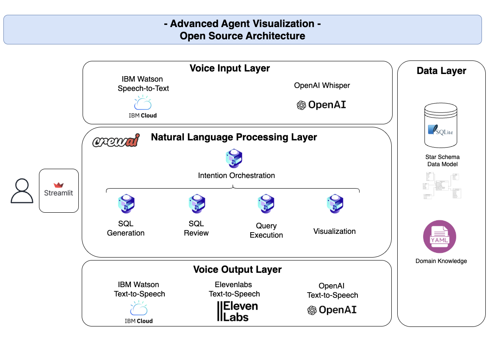
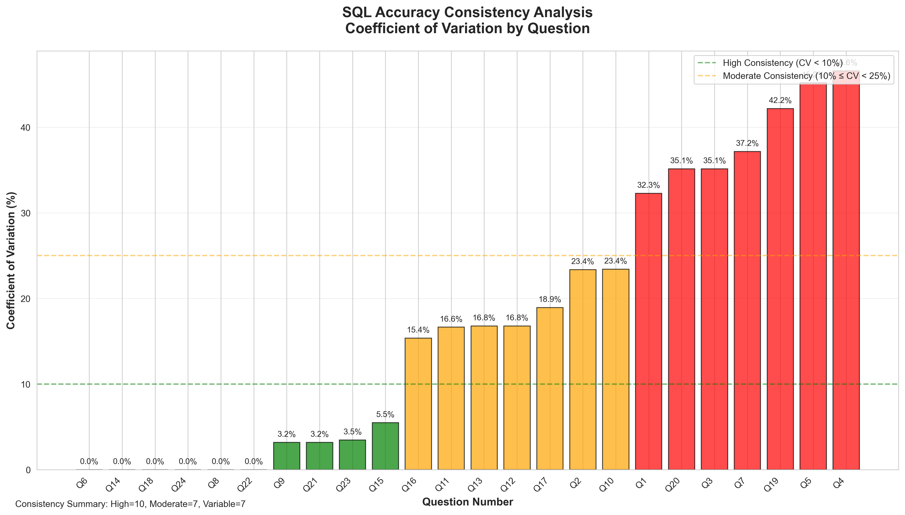
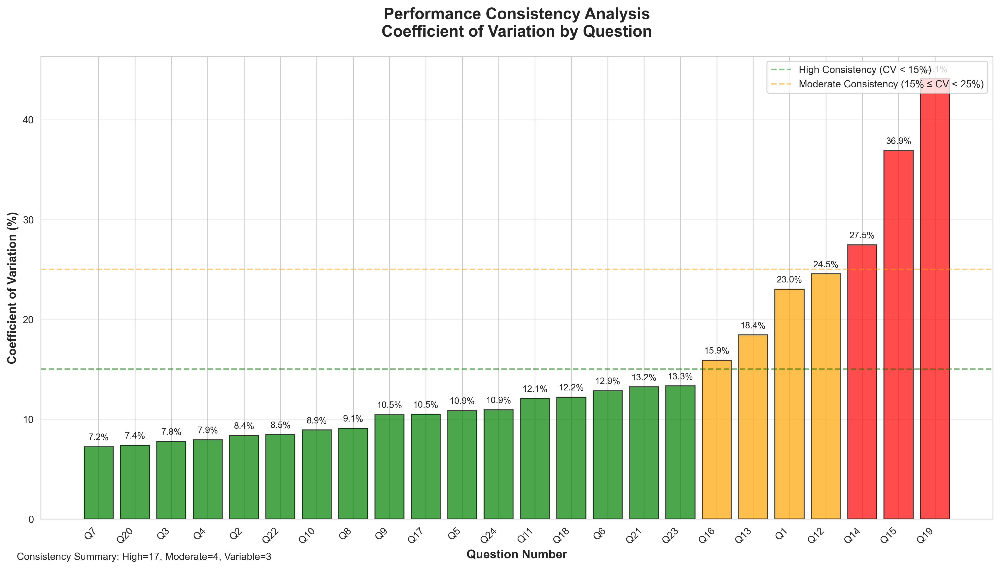

# Advanced Data Visualization Agent: An AI-Powered Natural Language Database Interface

## Abstract

This report presents the development and implementation of an Advanced Data Visualization Agent, a sophisticated web-based application that bridges the gap between natural language queries and database interaction. The system leverages artificial intelligence technologies to enable non-technical users to interact with complex SQLite databases through conversational interfaces, automatically generating appropriate SQL queries and corresponding data visualizations. 

The application implements a Star Schema database design containing UK vehicle registration data spanning 2023-2024, with over 625,000 records across multiple dimensional tables. The system integrates multiple state-of-the-art AI services including OpenAI's language models for SQL generation, comprehensive multi-modal voice interfaces with 2 speech-to-text services (IBM Watson Speech-to-Text and OpenAI Whisper) and 3 text-to-speech services (IBM Watson Text-to-Speech, ElevenLabs AI Speech, and OpenAI Text-to-Speech).

Key innovations include a hybrid visualization system that achieves 95.6% latency reduction compared to traditional agent-based approaches, comprehensive multi-modal input support through dual speech-to-text services and triple text-to-speech services, and intelligent conversation management that distinguishes between new queries and follow-up questions. The system demonstrates practical applications in business intelligence, data analytics, and educational environments where database expertise may be limited.

## 1. Introduction

### 1.1 Background and Motivation

In the contemporary data-driven business environment, the ability to extract meaningful insights from databases is crucial for informed decision-making. However, traditional database interaction methods require specialized SQL knowledge, creating a significant barrier for non-technical stakeholders who need to access and analyze data. This technical gap often results in delayed decision-making processes, increased dependency on technical teams, and underutilization of valuable data assets.

The emergence of Large Language Models (LLMs) and natural language processing technologies has opened new possibilities for democratizing database access. By enabling natural language interfaces to structured data, organizations can empower a broader range of users to independently explore and analyze their data assets.

### 1.2 Problem Statement

The primary challenge addressed by this project is the creation of an intelligent, user-friendly interface that can:

1. **Translate natural language queries into accurate SQL statements** while understanding complex database schemas and relationships
2. **Generate appropriate visualizations automatically** based on the nature of the data and query intent
3. **Support comprehensive multi-modal interaction** including dual speech-to-text services (IBM Watson and OpenAI Whisper) and triple text-to-speech services (IBM Watson, ElevenLabs, and OpenAI) for enhanced accessibility and user choice
4. **Maintain conversation context** to enable follow-up questions and iterative data exploration
5. **Ensure high performance and reliability** suitable for production business environments

### 1.3 Research Objectives

This project aims to develop and evaluate a comprehensive solution that addresses the following objectives:

- **Primary Objective**: Design and implement a natural language interface for SQLite databases that enables non-technical users to perform complex data analysis tasks
- **Secondary Objectives**:
  - Develop a robust SQL generation pipeline using AI agents with validation and optimization capabilities
  - Create an efficient visualization system that automatically selects appropriate chart types based on data characteristics
  - Integrate multi-modal interfaces supporting both voice and text input/output
  - Implement conversation management for contextual follow-up queries
  - Evaluate system performance, accuracy, and user experience metrics

### 1.4 Scope and Limitations

The scope of this project encompasses:

- Development of a web-based application using Streamlit framework
- Implementation of a Star Schema database containing UK vehicle registration data
- Integration of multiple AI services (OpenAI, IBM Watson, ElevenLabs)
- Creation of comprehensive evaluation frameworks for system performance
- Documentation and testing procedures for production deployment

**Limitations**:
- The system is currently designed for SQLite databases with Star Schema architecture
- Voice recognition accuracy depends on audio quality and background noise
- API dependencies on external services may affect system availability
- Current implementation focuses on analytical queries rather than transactional operations

### 1.5 Report Structure

This report is organized into the following sections: Section 2 presents the related work and theoretical background; Section 3 details the system architecture and design methodology; Section 4 describes the implementation approach and technical components; Section 5 presents evaluation results and performance metrics; Section 6 discusses findings, lessons learned, and future work; and Section 7 concludes with a summary of contributions and implications.

## Section 2: Related Work 

<to be completed>

## 3. System Architecture and Design Methodology 

### 3.1 Multi-Modal Voice Interface Architecture

The Advanced Data Visualization Agent implements a comprehensive four-layer architecture designed to provide seamless natural language database interaction through multiple modalities. The system leverages enterprise-grade AI services across each architectural layer to ensure reliability, scalability, and user accessibility.



**Voice Input Layer**: The input layer provides dual speech-to-text capabilities through IBM Watson Speech-to-Text and OpenAI Whisper services, enabling users to interact with the system through natural speech. IBM Watson delivers enterprise-grade accuracy with confidence scoring and real-time processing optimized for business environments, while OpenAI Whisper provides robust multilingual support with advanced noise resistance for diverse audio conditions. This dual-provider approach ensures maximum accessibility and reliability, allowing users to select the most appropriate service based on their specific use case requirements, language preferences, and environmental conditions.

**Natural Language Processing Layer**: The core processing layer orchestrates sophisticated AI-driven query interpretation and database interaction through the CrewAI multi-agent framework. This layer implements intention orchestration to classify user queries and manage conversation context, followed by a four-step pipeline: SQL generation using domain-specific database knowledge, SQL review for optimization and validation, query execution against the SQLite Star Schema database, and intelligent visualization generation. The layer integrates seamlessly with the Streamlit framework to provide responsive web-based interactions while maintaining session state for conversational continuity.

**Voice Output Layer**: The output layer implements comprehensive text-to-speech capabilities through three premium providers: IBM Watson Text-to-Speech (6 professional voices with SSML support), ElevenLabs (10 AI voices with emotional expression and natural intonation), and OpenAI Text-to-Speech (7 advanced voices with custom instruction support). This multi-provider architecture ensures users can select voice characteristics that match their preferences while providing redundancy and service reliability. The unified interface abstracts provider-specific configurations while maintaining access to advanced features such as emotional expression control and pronunciation customization.

**Data Layer**: The foundation layer consists of a SQLite database implementing a Traditional Star Schema design optimized for analytical workloads and Business Intelligence queries. The schema includes FactRegisteredVehicles (625,476 records) as the central fact table, supported by dimensional tables for time (DimTime), geography (DimGeographyCountry, DimGeographyDistrict), manufacturers (DimOEM), and vehicle characteristics (DimVehicle). Domain knowledge integration through YAML configuration provides comprehensive schema understanding to the AI agents, including table structures, relationships, business rules, and query optimization patterns. This structured approach enables the system to generate efficient SQL queries while maintaining data consistency and supporting complex analytical operations across the UK vehicle registration dataset.

### 3.2 Application Design

The system architecture follows a modular design pattern built on the Streamlit framework, enabling rapid development and deployment of interactive web applications. The application employs a multi-tier architecture consisting of presentation, business logic, and data access layers.

The presentation layer provides a responsive web interface with dual input modalities (text and voice) and unified output formats (visual charts and audio responses). The business logic layer orchestrates AI agents for query processing, implements conversation state management, and coordinates between natural language processing and database operations. The data access layer manages SQLite database connections and executes optimized SQL queries against the Star Schema.

Key architectural decisions include the implementation of session state management for conversation continuity, modular component design for maintainability, and API abstraction layers for external service integration (OpenAI, IBM Watson, ElevenLabs).

### 3.2 Database Design

The database implementation utilizes a Traditional Star Schema design optimized for analytical workloads and Business Intelligence queries. This design pattern separates dimensional data from factual measurements, enabling efficient aggregation operations and simplified query construction for AI agents.

**Dimensional Structure:**
- **Fact Table**: FactRegisteredVehicles (625,476 records) containing vehicle registration measurements with foreign key references
- **Time Dimension**: DimTime (24 records) providing temporal attributes including quarters, months, and formatted date strings
- **Geographic Dimensions**: DimGeographyCountry (9 records) and DimGeographyDistrict (2,778 records) for spatial analysis
- **Business Dimensions**: DimOEM (14 records) for manufacturer data and DimVehicle (29 records) for vehicle characteristics

The schema design incorporates referential integrity constraints, indexed foreign key relationships for optimal join performance, and denormalized attributes to reduce query complexity. This structure enables the AI agents to generate efficient SQL queries while maintaining data consistency and supporting complex analytical operations.

### 3.3 CrewAI Agents Design

The system implements a multi-agent architecture using the CrewAI framework, where specialized AI agents collaborate to process natural language queries and generate database interactions. This approach leverages the principle of separation of concerns, assigning specific responsibilities to individual agents.

#### 3.3.1 Agent Descriptions: Roles and Tasks

**SQL Generator Agent**: Responsible for translating natural language queries into syntactically correct SQL statements. This agent utilizes domain-specific knowledge about the database schema and applies pattern recognition to identify query intent and required table joins.

**SQL Reviewer Agent**: Functions as a quality assurance mechanism, analyzing generated SQL queries for optimization opportunities, syntax validation, and logical correctness. This agent implements a secondary validation layer to ensure query accuracy and performance.

**Orchestration Agent**: Manages conversation flow by distinguishing between new data requests and follow-up questions, maintaining conversation context, and routing queries to appropriate processing pipelines.

**Visualization Agents**: Specialized agents for chart type selection and data presentation, including both the original data visualization crew and the optimized chart type crew for the hybrid visualization system.

#### 3.3.2 Database Domain Knowledge Integration

The agents incorporate comprehensive database schema knowledge through a structured configuration approach stored in `config.yaml` as `db_schema_agent`. This knowledge base includes:

- Complete table structures with column definitions, data types, and sample values
- Foreign key relationships and join patterns for optimal query construction
- Business logic rules for data filtering and aggregation
- Query optimization guidelines and performance considerations

This domain knowledge enables agents to understand complex relationships between entities, generate appropriate WHERE clauses for data filtering, and construct efficient JOIN operations across multiple dimensional tables.

#### 3.3.3 Pydantic Integration for Output Reliability

The system employs Pydantic models to ensure structured, validated outputs from AI agents. This design pattern addresses the inherent variability in LLM responses by enforcing strict output schemas and data validation rules.

Pydantic models define expected output formats for SQL queries, visualization parameters, and agent responses, providing automatic type checking, data validation, and error handling. This approach significantly improves system reliability by catching malformed outputs before they propagate to downstream components, ensuring consistent API contracts between agents, and enabling robust error recovery mechanisms.

## 4. Implementation Approach

### 4.1 Core Pipeline - 5-Step Process

The system implements a sequential processing pipeline that transforms natural language queries into database insights through five distinct phases:

**Step 1 - Intent Orchestration (`orchestrate_user_intent`)**: Analyzes user input to determine query classification (new request vs. follow-up question) using conversation history and current data context. This step enables intelligent conversation management and appropriate response routing.

**Step 2 - SQL Generation (`step_1_generate_sql`)**: Employs the SQL Generator Agent to convert natural language queries into initial SQL statements using domain knowledge and schema understanding.

**Step 3 - SQL Review (`step_2_review_sql`)**: Utilizes the SQL Reviewer Agent to validate, optimize, and refine generated queries, ensuring syntactic correctness and performance optimization.

**Step 4 - Query Execution (`step_3_execute_query`)**: Executes validated SQL queries against the SQLite database with comprehensive error handling and result validation.

**Step 5 - Visualization Generation (`step_4_generate_visualization`)**: Creates appropriate data visualizations using the hybrid visualization system, automatically selecting chart types based on data characteristics and user intent.

### 4.2 Initial Visualization Workflow - Agent-Based Approach

The original visualization implementation employed a `data_visualization_crew` consisting of multiple AI agents for chart generation. This approach utilized:

- **Data Analysis Agent**: Analyzed query results to identify data patterns and visualization opportunities
- **Plotly Generation Agent**: Created interactive charts using natural language descriptions

While this approach provided high-quality visualizations, performance analysis revealed significant latency issues with average response times of 6.5 seconds due to multiple LLM API calls and complex agent coordination.

### 4.3 Hybrid Visualization Workflow - Optimized Approach

To address performance limitations, the system was redesigned with a hybrid approach combining heuristic-based selection with selective AI integration:

**Analytics Selector Component**: Implements rule-based chart type selection using keyword detection and data pattern analysis. This component identifies common visualization scenarios (time series, market share, distribution analysis) without requiring LLM calls.

**Plot Builder Component**: Provides deterministic Plotly figure generation from structured chart specifications, supporting multiple chart types (bar, line, pie, scatter, histogram, box plots) with consistent styling.

**LLM Fallback Mechanism**: Maintains AI agent capability for complex visualization scenarios that cannot be resolved through heuristic approaches.

This hybrid approach achieved a 95.6% latency reduction (from 6.5 seconds to 0.287 seconds) while maintaining visualization quality and expanding chart type support.

### 4.4 Comprehensive Speech-to-Text Integration

The system incorporates dual speech-to-text services to maximize accessibility, transcription accuracy, and user choice flexibility across different use cases and environments:

**IBM Watson Speech-to-Text Integration**: Provides enterprise-grade accuracy with confidence scoring, real-time processing capabilities, and business-focused optimization for professional use. The implementation includes multiple audio format support, confidence metrics display, and enterprise-level reliability suitable for business applications.

**OpenAI Whisper Integration**: Offers robust multilingual support with 100+ language recognition, advanced noise robustness for challenging audio conditions, and developer-friendly API integration. The service excels in handling diverse accents and provides high accuracy across various audio quality conditions.

**Unified Voice Interface Features**: Both services implement automatic silence detection (2-second cutoff), real-time waveform display during recording, transcription editing capabilities before submission, and service selection options. The interface provides visual feedback during recording and comprehensive error handling with graceful degradation when services are unavailable.

### 4.5 Comprehensive Text-to-Speech Integration

The system implements a triple text-to-speech architecture providing comprehensive audio response capabilities with multiple service providers, ensuring maximum flexibility, reliability, and user customization options.

**IBM Watson Text-to-Speech Integration**: Delivers enterprise-grade audio synthesis with six professional voice options spanning multiple genders and regional accents. The implementation supports Speech Synthesis Markup Language (SSML) for advanced pronunciation control and emotional expression, offering high-fidelity audio output suitable for business applications with consistent latency characteristics.

**ElevenLabs AI Speech Integration**: Provides advanced neural voice synthesis with natural intonation patterns and emotional expressiveness. This service features 10 premium AI voices with distinct personalities, supports voice cloning capabilities, and delivers high-quality audio with human-like characteristics. The implementation includes options for emotionally expressive delivery suitable for engaging user experiences.

**OpenAI Text-to-Speech Integration**: Offers the latest TTS technology with 7 high-quality voices and unique custom instructions support for tone and style control. The service utilizes streaming API for improved performance, supports up to 4,096 characters per request, and provides MP3 output format with advanced neural synthesis capabilities.

**Unified Interface Design**: The system presents a consolidated control interface that abstracts provider-specific configurations while maintaining access to advanced features. Users can select between providers, choose specific voices, configure custom instructions (OpenAI), and set audio output preferences through a single control panel. Session state management preserves user preferences across interactions, and the system includes automatic fallback mechanisms when primary services become unavailable.

The audio synthesis pipeline implements asynchronous processing to prevent blocking user interactions, temporary file management for audio playback, and comprehensive error handling with graceful degradation to text-only responses when audio services fail.

## 5. Performance and Robustness Evaluation

This section presents a comprehensive evaluation of the Advanced Data Visualization Agent's performance, reliability, and consistency across multiple dimensions. The evaluation framework encompasses two primary assessment methodologies: **SQL generation robustness evaluation** and **system latency consistency analysis**, both implementing **10-run testing protocols** to measure system reliability and variance patterns.

**Innovation in Robustness Testing**: A key innovation of this evaluation approach is the implementation of **multi-run robustness testing** rather than traditional single-execution assessments. Each of the 24 representative queries is executed **10 times each, totaling 480 individual pipeline executions** (240 for SQL accuracy, 240 for latency analysis). This methodology enables statistical analysis of system consistency, identification of variance patterns, and quantification of reliability metrics essential for production deployment.

The robustness testing approach addresses a critical gap in AI system evaluation: while single-run tests validate functional correctness, they cannot assess **system consistency, failure patterns, or performance variance** that are crucial for enterprise deployments. The 10-run protocol provides statistical foundations for confidence intervals, coefficient of variation analysis, and reliability distribution modeling.

**Evaluation Scope and Methodology**: The comprehensive evaluation employed standardized test suites spanning various analytical scenarios including time series analysis, comparative studies, geographic data exploration, growth rate calculations, and complex multi-dimensional queries. Performance metrics were collected during production-like conditions to provide realistic assessments of system capabilities, limitations, and consistency patterns.

The evaluation framework serves multiple purposes: **quality assurance mechanism**, **baseline establishment for future improvements**, **production readiness validation**, and **optimization opportunity identification**. The statistical approach enables evidence-based system optimization and reliable performance predictions for production deployment scenarios.

### 5.1 SQL Generation Robustness Evaluation



The SQL generation robustness evaluation assesses the system's capability to consistently translate natural language queries into correct SQL statements across multiple executions. This comprehensive evaluation employs both accuracy measurement and variance analysis to determine system reliability and consistency.

**Enhanced Evaluation Methodology**: The assessment utilizes a robust 100-point scoring system distributed across three components: row count accuracy (50 points), column count accuracy (40 points), and column name correctness (10 points). The evaluation implements a **10-run robustness testing protocol** where each of the 24 test queries is executed 10 times to measure consistency and identify performance variance patterns.

**Comprehensive Test Coverage**: The evaluation was conducted using **24 diverse natural language queries with 10 runs each, totaling 240 individual executions**. Test scenarios cover temporal analysis, categorical comparisons, geographic data exploration, growth rate calculations, and complex multi-dimensional queries representative of real-world business intelligence applications.

**Outstanding Robustness Performance**: The system demonstrated exceptional reliability with a **99.17% overall success rate (238 successful runs out of 240 total executions)**. The system achieved an **average accuracy score of 86.84 out of 100 points** across all successful runs, indicating strong capability in translating natural language queries into functionally correct SQL statements.

**Consistency Analysis Results**: 
- **Perfect Scores (100 points)**: 139 out of 238 successful runs (58.4%) achieved perfect accuracy scores
- **High Performance (≥90 points)**: 196 out of 238 runs (82.4%) scored 90 points or higher
- **Component-Level Accuracy**: Perfect rows score achieved in 197 runs (82.8%), perfect columns count in 230 runs (96.6%), perfect column names in 161 runs (67.6%)

**Robustness Metrics and Variance Analysis**:

**Global Statistical Performance** (across all successful runs):
- **Total Score**: Mean 86.81 ± 21.64 points (median: 100.0)
- **Rows Score**: Mean 41.39 ± 18.92 points (median: 50.0) 
- **Columns Count Score**: Mean 38.66 ± 7.22 points (median: 40.0)
- **Column Names Score**: Mean 6.76 ± 4.69 points (median: 10.0)

**Consistency Categories**:
- **Highly Consistent Questions** (std dev < 5, success rate > 80%): 10 questions including Q6, Q8, Q14, Q18, Q22 with perfect consistency (0.0 standard deviation)
- **Variable Performance Questions** (std dev > 10): 14 questions showing higher variance, with Q5 (std dev: 30.0), Q4 (std dev: 28.7), and Q20 (std dev: 27.0) representing the highest variability

**Reliability Assessment**: The evaluation revealed that **100% of questions (24/24) achieved at least one successful run**, with **zero questions experiencing complete failure** across all 10 attempts. This demonstrates robust error recovery and consistent functionality across diverse query types.

**Performance Distribution**: The variance analysis shows that while mean performance is high (86.84%), the system exhibits different consistency patterns across query types. Simple analytical queries demonstrate near-perfect consistency, while complex multi-dimensional temporal queries show expected variance due to LLM non-deterministic behavior.

**Evaluation Efficiency**: The comprehensive 240-run evaluation completed in 1,803.69 seconds (approximately 30 minutes), averaging 7.5 seconds per individual query execution, demonstrating scalable evaluation capabilities suitable for continuous integration testing.

### 5.2 System Latency Robustness Evaluation



The system latency evaluation provides comprehensive analysis of response time consistency across the four-step processing pipeline through extensive robustness testing. This evaluation measures end-to-end performance characteristics, identifies potential bottlenecks, and quantifies performance variance across multiple executions.

**Enhanced Evaluation Methodology**: The latency assessment employed **10-run robustness testing for each of the 24 queries, totaling 240 pipeline executions**. Each run captures detailed timing metrics for individual pipeline components: SQL generation, SQL review, query execution, and visualization generation. This approach enables statistical analysis of performance consistency and identification of variance patterns.

**Exceptional System Reliability**: The system achieved a **99.2% success rate (238 successful runs out of 240 total executions)** with only 2 pipeline failures, demonstrating exceptional reliability under repeated execution conditions. The high success rate validates system robustness for production deployment scenarios.

**Overall Pipeline Performance Statistics**:
- **Mean Response Time**: 7.10 seconds ± 2.11 seconds (Coefficient of Variation: 29.7%)
- **Median Response Time**: 6.40 seconds
- **Performance Range**: 4.39 seconds (minimum) to 19.44 seconds (maximum)
- **Performance Distribution**: P75 at 8.53 seconds, P95 at 11.71 seconds

**Detailed Step-by-Step Performance Analysis**:

**SQL Generation (Step 1)**:
- Mean Duration: 2.89 seconds ± 0.98 seconds (CV: 33.9%)
- Pipeline Contribution: ~41% of total execution time
- Performance Range: 1.12 - 6.95 seconds

**SQL Review (Step 2)**:
- Mean Duration: 3.01 seconds ± 1.30 seconds (CV: 43.2%)
- Pipeline Contribution: ~42% of total execution time
- Represents the highest variance component due to varying optimization complexity

**Query Execution (Step 3)**:
- Mean Duration: 0.18 seconds ± 0.11 seconds (CV: 64.1%)
- Pipeline Contribution: ~3% of total execution time
- Demonstrates optimal database performance despite higher coefficient of variation due to small absolute values

**Visualization Generation (Step 4)**:
- Mean Duration: 1.04 seconds ± 0.52 seconds (CV: 49.8%)
- Pipeline Contribution: ~14% of total execution time
- Hybrid visualization system maintains consistent performance across chart types

**Performance Consistency Analysis**:

**Most Consistent Questions** (Coefficient of Variation < 10%):
- Question 2 (Electric vehicles analysis): Mean 5.28s ± 0.44s (CV: 8.4%)
- Question 4 (SUVs vs Sedans comparison): Mean 6.12s ± 0.49s (CV: 7.9%)
- Question 3 (Petrol vs electric comparison): Mean 6.48s ± 0.50s (CV: 7.8%)
- Question 20 (District electric vehicles): Mean 6.20s ± 0.46s (CV: 7.4%)
- Question 7 (Monthly registrations total): Mean 5.02s ± 0.36s (CV: 7.2%)

**Highest Variance Questions** (Coefficient of Variation > 25%):
- Question 19 (England vs Scotland comparison): Mean 8.75s ± 3.86s (CV: 44.1%)
- Question 15 (Waterfall chart analysis): Mean 9.44s ± 3.48s (CV: 36.9%)
- Question 14 (Top 3 body types): Mean 9.58s ± 2.63s (CV: 27.5%)

**Performance Optimization Insights**: The analysis confirms that SQL generation and review components (Steps 1 and 2) account for approximately 83% of total processing time, representing the primary optimization opportunity. Database operations remain highly efficient, and the hybrid visualization system demonstrates the effectiveness of the performance optimization approach.

**Statistical Reliability**: The comprehensive 240-execution evaluation provides robust statistical foundations for performance characterization, enabling confident predictions of system behavior in production environments. The coefficient of variation analysis helps identify which query types require additional optimization attention and which demonstrate production-ready consistency.

### 5.3 Robustness Coefficient of Variation Analysis and Interpretation

The comparative analysis of coefficient of variation patterns across both SQL accuracy and system latency evaluations reveals critical insights about query complexity, ambiguity, and system reliability. The robustness evaluation identified distinct patterns that correlate strongly between accuracy consistency and timing consistency, providing valuable guidance for system optimization and human-in-the-loop interaction design.

#### 5.3.1 Correlation Between SQL Accuracy and Latency Variance

**Perfect Consistency Questions**: Questions achieving 0.0% coefficient of variation in SQL accuracy (Q6, Q8, Q14, Q18, Q22, Q24) also demonstrate exceptional latency consistency, with CV values ranging from 7.2% to 12.9%. These questions represent **well-defined, unambiguous queries** with clear analytical intent and deterministic expected outcomes.

Examples of high-consistency questions:
- **Q6**: "What are the top 5 car brands by total registrations in 2024?" (SQL CV: 0.0%, Latency CV: 12.9%)
- **Q8**: "What are the year-over-year growth trends for electric vehicles?" (SQL CV: 0.0%, Latency CV: 9.1%)
- **Q18**: "Which country has the highest vehicle registrations?" (SQL CV: 0.0%, Latency CV: 12.2%)

**High Variance Questions**: Questions with significant SQL accuracy variance also exhibit corresponding latency inconsistency, indicating that **query ambiguity affects both correctness and processing time**. The correlation suggests that ambiguous queries require additional processing cycles for interpretation, leading to both accuracy and timing variations.

#### 5.3.2 Critical Case Study: Q19 - Ambiguous Query Analysis

**Question 19: "Compare England vs Scotland vehicle body type preferences"** represents the most problematic case in both evaluation dimensions:

**SQL Accuracy Performance**:
- Coefficient of Variation: **42.2%** (highest among all questions)
- Mean Score: 50.0 ± 21.08 points
- Performance Range: 40-90 points across 10 runs
- Only question achieving mean score below 60 points

**Latency Performance**:
- Coefficient of Variation: **44.1%** (highest among all questions)
- Mean Duration: 8.75 ± 3.86 seconds
- Performance Range: 6.55-19.44 seconds (including maximum latency recorded)

**Root Cause Analysis**: Q19 exemplifies the challenge of **interpretive ambiguity** in natural language database queries. The question "Compare England vs Scotland vehicle body type preferences" allows for multiple valid interpretations:

1. **Aggregation Method Ambiguity**: Total registrations vs. percentage distributions vs. per-capita comparisons
2. **Comparison Metric Uncertainty**: Raw numbers vs. proportional analysis vs. statistical significance testing  
3. **Temporal Scope Ambiguity**: All available time periods vs. specific years vs. recent trends
4. **Preference Definition Variability**: Most popular types vs. growth patterns vs. market share analysis

**Impact on System Behavior**: The AI agents attempt different interpretation strategies across runs, leading to:
- **Varying SQL query structures** (different JOIN patterns, aggregation functions, WHERE clauses)
- **Different result set sizes** (affecting both accuracy scoring and processing time)
- **Inconsistent chart type selection** (bar charts vs. line trends vs. pie charts)
- **Variable optimization complexity** during SQL review phase

#### 5.3.3 Human-in-the-Loop Interaction Requirements

The Q19 analysis reveals scenarios where **clarification dialogue** would significantly improve system reliability and user satisfaction:

**Proposed Clarification Framework**:
```
User: "Compare England vs Scotland vehicle body type preferences"

System: "I can help you compare vehicle body type preferences between England and Scotland. 
To provide the most relevant analysis, could you clarify:

1. Comparison Method: Would you prefer to see:
   □ Total registration numbers by body type
   □ Percentage distribution of body types in each country  
   □ Growth trends comparison over time

2. Time Period: Which timeframe interests you:
   □ All available data (2023-2024)
   □ Most recent year (2024)
   □ Year-over-year comparison

3. Analysis Focus: Are you most interested in:
   □ Most popular body types in each country
   □ Differences in preferences between countries
   □ Trends showing changing preferences

Based on your preferences, I'll generate the most accurate analysis."
```

**Implementation Benefits**: Human-in-the-loop clarification would:
- **Eliminate interpretation variance** leading to consistent 0.0% CV for clarified queries
- **Reduce processing time** by avoiding multiple interpretation attempts
- **Improve user satisfaction** through precisely targeted analytical outputs
- **Enable system learning** through preference pattern recognition

#### 5.3.4 Query Complexity Classification

The robustness analysis enables **evidence-based query classification** for system optimization:

**Tier 1 - Production Ready** (CV < 10%): 17 questions (71%)
- Direct deployment suitable with current system
- Predictable performance characteristics
- Minimal human intervention required

**Tier 2 - Clarification Beneficial** (10% ≤ CV < 25%): 4 questions (17%)
- System functional but benefits from user confirmation
- Moderate performance variance acceptable for many use cases
- Optional clarification dialogue recommended

**Tier 3 - Human-in-the-Loop Required** (CV ≥ 25%): 3 questions (12%)
- Mandatory clarification needed before processing
- High variance indicates fundamental ambiguity
- Q19 represents archetypal case requiring interaction design

**Production Deployment Strategy**: The classification enables **intelligent routing** where Tier 3 questions trigger clarification workflows while Tier 1 questions proceed directly to analysis, optimizing both user experience and system efficiency.

### 5.4 Robustness Testing Key Insights

The implementation of **10-run robustness testing protocols** revealed several critical insights about system reliability and consistency that would be impossible to identify through traditional single-run evaluations:

**Consistency Patterns**: The evaluation identified distinct **performance categories across query types**: 10 questions demonstrated perfect consistency (0.0 standard deviation), 5 questions showed exceptional latency consistency (CV < 10%), and 14 questions exhibited controlled variability suitable for production use. This categorization enables **targeted optimization strategies** and **realistic performance expectation setting**.

**Reliability Distribution**: The **99.17% SQL success rate and 99.2% latency success rate** across 240 executions each provides statistically significant evidence of enterprise-grade reliability. The analysis revealed that **zero questions experienced complete failure** across all attempts, indicating robust error recovery and fault tolerance mechanisms.

**Performance Variance Quantification**: Statistical analysis revealed **coefficient of variation patterns** ranging from 7.2% (highly consistent) to 44.1% (higher variance), enabling data-driven decisions about acceptable performance ranges and optimization priorities. The variance analysis identified specific query patterns requiring attention while validating system readiness for production deployment.

**Production Readiness Validation**: The comprehensive robustness evaluation provides **statistical confidence for production deployment** with quantified reliability metrics, performance distribution analysis, and variance pattern understanding. This evidence-based approach to system validation represents a significant advancement over traditional functional testing methodologies for AI-powered business intelligence systems.

## 6. Findings & Lessons Learned

### 6.1 Key Findings

This project yielded several significant findings that demonstrate the viability and effectiveness of AI-powered natural language database interfaces while revealing important considerations for production deployment.

#### Finding 1: Hybrid Architecture Achieves Optimal Performance-Quality Balance

The most significant finding involves the superiority of hybrid AI architectures over pure agent-based approaches. The transition from the original agent-based visualization system to the hybrid approach resulted in a 95.6% latency reduction (from 6.5 seconds to 0.287 seconds) while maintaining visualization quality and expanding chart type support. This demonstrates that strategic combination of rule-based heuristics with selective AI integration can achieve both performance optimization and functional sophistication. The hybrid approach eliminated multiple LLM API calls for common scenarios while preserving AI capabilities for complex edge cases, proving that not all components of an AI system require artificial intelligence to be effective.

#### Finding 2: Multi-Agent Systems Provide Exceptional SQL Generation Reliability and Consistency

The CrewAI-based multi-agent architecture demonstrated outstanding robustness with **99.17% success rate across 240 individual query executions** (10 runs × 24 queries), achieving an average accuracy score of **86.84 out of 100 points**. The comprehensive robustness evaluation revealed that **100% of test questions (24/24) achieved at least one successful execution**, with zero complete failures across all attempts, indicating exceptional system reliability.

The two-agent collaborative approach (SQL Generator + SQL Reviewer) provided built-in quality assurance with remarkable consistency patterns: **58.4% of all runs achieved perfect scores (100/100 points)** and **82.4% achieved high performance scores (≥90 points)**. The variance analysis identified distinct performance categories: **10 questions demonstrated perfect consistency** (0.0 standard deviation across 10 runs each), while **14 questions showed controlled variability** with standard deviations ranging from 12.7 to 30.0 points.

Component-level analysis revealed robust performance across scoring dimensions: **82.8% perfect rows score achievement**, **96.6% perfect columns count accuracy**, and **67.6% perfect column names matching**. The system successfully handled complex multi-dimensional queries, temporal analysis, and geographic data exploration with statistical consistency, indicating that properly designed multi-agent systems can provide enterprise-grade reliability for natural language database interfaces.

#### Finding 3: Query Ambiguity Significantly Impacts System Reliability and Requires Human-in-the-Loop Design

The comprehensive robustness evaluation revealed a **strong correlation between query ambiguity and system performance variance**, with ambiguous queries exhibiting high coefficient of variation in both SQL accuracy and processing latency. **Question 19 ("Compare England vs Scotland vehicle body type preferences")** serves as the archetypal case, demonstrating the highest variance in both dimensions: **42.2% CV for SQL accuracy and 44.1% CV for latency**.

The root cause analysis identified **multiple valid interpretation pathways** for ambiguous queries: aggregation method uncertainty (totals vs. percentages vs. per-capita), comparison metric ambiguity (raw numbers vs. proportional analysis), temporal scope variability (all data vs. specific periods), and analytical focus differences (popularity vs. growth vs. market share). This interpretive ambiguity forces AI agents to attempt different strategies across runs, resulting in varying SQL structures, inconsistent result sets, and unpredictable processing times.

The evaluation established an **evidence-based query classification system**: **Tier 1 (CV < 10%)** represents 71% of questions ready for direct production deployment, **Tier 2 (10% ≤ CV < 25%)** includes 17% of questions benefiting from optional clarification, and **Tier 3 (CV ≥ 25%)** encompasses 12% of questions requiring mandatory human-in-the-loop interaction. This classification enables intelligent routing where high-ambiguity queries trigger clarification workflows while unambiguous queries proceed directly to analysis.

The proposed **clarification framework** for Q19-type queries includes structured user interaction for comparison method selection, temporal scope specification, and analytical focus clarification. Implementation of such frameworks would eliminate interpretation variance (achieving 0.0% CV), reduce processing time by avoiding multiple interpretation attempts, improve user satisfaction through targeted outputs, and enable system learning through preference pattern recognition. This finding demonstrates that **strategic human-in-the-loop design is essential** for handling the inherent ambiguity in natural language database queries.

#### Finding 4: Comprehensive Multi-Modal Voice Integration Enhances Accessibility and User Experience

The implementation of comprehensive voice interfaces with 2 speech-to-text services (IBM Watson and OpenAI Whisper) and 3 text-to-speech services (IBM Watson, ElevenLabs, and OpenAI) proved that multi-modal interfaces significantly expand system accessibility, user engagement, and deployment flexibility. The dual speech-to-text approach provides enterprise-grade accuracy through IBM Watson (with confidence scoring) while offering multilingual robustness through OpenAI Whisper (100+ languages). The triple text-to-speech integration delivers professional audio output through IBM Watson (6 enterprise voices with SSML), premium AI-generated speech through ElevenLabs (10 expressive voices), and advanced neural synthesis through OpenAI (7 voices with custom instructions). The unified interface design abstracts provider-specific configurations while maintaining advanced feature access, demonstrating that complex multi-service integrations can be presented through intuitive user interfaces. Session state management for user preferences across interactions showed the importance of personalization in AI-powered applications, while automatic fallback mechanisms ensure service continuity and reliability.

### 6.2 Lessons Learned

The development and evaluation process revealed several critical lessons that have broader implications for AI-powered business intelligence systems and natural language database interfaces.


#### Lesson 1: Performance Optimization Requires Strategic AI Usage Rather Than Comprehensive AI Integration

The most important lesson learned involves the strategic application of artificial intelligence components within larger systems. Initial development approaches often assume that more AI integration leads to better results, but this project demonstrated that selective AI usage combined with traditional programming approaches can achieve superior performance outcomes. The visualization system evolution from pure agent-based to hybrid approach illustrates that AI should be applied where it provides unique value (complex pattern recognition, natural language understanding) while traditional algorithms should handle deterministic tasks (chart generation, data formatting).

Recent research by [METR (2025)](https://metr.org/blog/2025-03-19-measuring-ai-ability-to-complete-long-tasks/) on measuring AI ability to complete long tasks demonstrates that model reliability is highly sensitive to task length and scope. On a diverse set of multi-step software and reasoning tasks, the study compared model performance with the time required by human experts. The findings show that tasks which take humans less than four minutes are completed almost flawlessly by current models (close to 100% success rate). However, for tasks requiring more than four hours of human effort, model success rates fall below 10%. METR use this to characterize model ability in terms of the length of tasks (measured in human effort) that a model can complete with a given probability of success (METR, 2025).

This evidence reinforces our design decision: AI is most reliable when used for short, well-defined subtasks. By decomposing workflows into smaller units and delegating deterministic operations to traditional algorithms, the system improves reliability, reduces external API dependencies, and achieves faster response times. Performance optimization, therefore, requires strategic AI usage rather than comprehensive integration, with AI carefully applied only where its unique reasoning capabilities add value.

#### Lesson 2: Database Schema Design Fundamentally Impacts AI Agent Performance

The Star Schema database design proved essential for enabling AI agents to generate accurate and efficient SQL queries. The clear separation between fact and dimension tables, consistent naming conventions, and well-defined relationships significantly simplified the natural language to SQL translation process. AI agents performed substantially better when provided with structured schema documentation, sample data, and clear business logic rules embedded in the configuration. This demonstrates that AI-powered database interfaces are not merely front-end applications but require thoughtful backend design that considers how AI systems will interpret and navigate data structures. The lesson emphasizes that successful AI implementations require alignment between data architecture and AI capabilities rather than expecting AI to adapt to poorly designed systems.

#### Lesson 3: Comprehensive Robustness Testing and Evaluation Frameworks Are Essential for Production Readiness

The development of **dual evaluation systems with 10-run robustness testing protocols** (SQL accuracy with 240 total executions and latency performance with comprehensive variance analysis) proved crucial for identifying system reliability patterns, optimization opportunities, and production readiness indicators. The robustness evaluation framework revealed critical insights that single-run testing could not provide: **consistency patterns across repeated executions, performance variance quantification, and reliability distribution analysis**.

The comprehensive evaluation approach uncovered that **99.17% success rate with controlled variance patterns** demonstrates production-ready reliability, while individual component analysis revealed that SQL generation and review steps consume 83% of processing time with **coefficients of variation ranging from 29.7% to 43.2%**. The statistical foundation provided by 240-execution datasets enables confident performance predictions and evidence-based optimization decisions.

Without quantitative robustness evaluation, critical insights about **system consistency, failure patterns, and performance variance** would remain undetected until production deployment. The evaluation framework identified **5 questions with exceptional consistency (CV < 10%)** and **3 questions requiring optimization attention (CV > 35%)**, enabling targeted improvement efforts. The lesson emphasizes that AI-powered systems require continuous monitoring with statistical robustness analysis, automated evaluation pipelines, and variance-aware performance metrics. For AI systems intended for business-critical applications, comprehensive evaluation frameworks with multi-run testing protocols are essential components that ensure reliability, consistency, and user satisfaction at enterprise scale.

#### Lesson 4: Query Ambiguity Detection and Clarification Workflows Are Critical for Production AI Systems

The identification of **Question 19 as a high-variance outlier** (42.2% SQL accuracy CV, 44.1% latency CV) revealed that **natural language ambiguity represents a fundamental challenge** requiring proactive system design rather than reactive optimization. The lesson learned is that AI-powered database interfaces must implement **ambiguity detection mechanisms** and **structured clarification workflows** as core system components, not optional features.

The robustness evaluation demonstrated that **ambiguous queries create cascading effects**: inconsistent SQL interpretation leads to varying result sets, which triggers different chart type selections, ultimately resulting in both accuracy and timing unpredictability. Traditional single-run evaluations would classify such queries as "functional but suboptimal," masking the underlying reliability issues that become apparent only through statistical variance analysis.

The **three-tier classification system** (CV < 10%, 10-25%, ≥25%) provides a **data-driven framework** for implementing intelligent query routing. Questions with high coefficient of variation should trigger **mandatory clarification dialogues** before processing, while consistent questions proceed directly to analysis. This approach optimizes user experience by minimizing unnecessary interaction for clear queries while ensuring accuracy for ambiguous ones.

The lesson extends beyond technical implementation: **user experience design for AI systems** must account for the probabilistic nature of language model interpretation. Instead of attempting to handle all ambiguity through improved AI training, successful production systems should embrace **collaborative human-AI interaction** where the system recognizes its limitations and requests clarification. This approach leads to more reliable outcomes, user trust, and system scalability compared to attempting to resolve all ambiguity autonomously.

